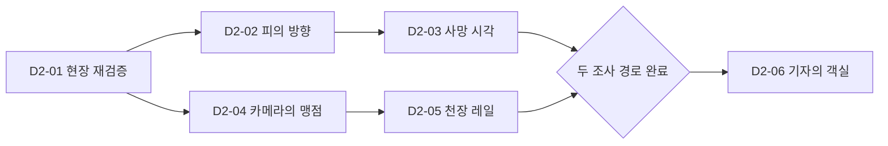
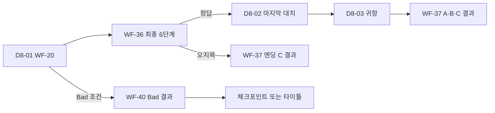

# Under the Horizon UI 상태 전이·장면 매핑

## 1. 문서 정보

| 항목 | 값 |
|---|---|
| 상태 | 승인 기준 |
| 작성일 | 2026-07-28 |
| 화면 상태 | WF-01~WF-40 |
| 기본 화면 유형 | 38종 |
| 독립 상태 변형 | 대화 선택 상태, 최종 지목 |
| 게임 장면 | P-01~D8-03, 총 41개 |
| 기준 문서 | `Under_the_Horizon_UI_Decision_Record_KR.md` |
| 화면 정의 | `Under_the_Horizon_UI_Wireframe_Spec_KR.md` |

이 문서는 40개 UI 상태의 진입·종료·취소·저장 복원 계약과 41개 게임
장면의 UI 조합을 한곳에서 관리한다.

41개 장면마다 별도 UI를 만들지 않는다. 장면은 공통 화면 셸과
WF-01~WF-40 상태를 조합하며, 장소·인물·대사·퍼즐 데이터만 교체한다.

## 2. 표기와 공통 계약

### 2.1 전이 표기

| 표기 | 의미 |
|---|---|
| `→` | 사용자 행동 또는 완료 이벤트에 의한 다음 상태 |
| `↩` | 닫기·취소 후 직전 상태와 표시 문맥 복원 |
| `조건` | 플래그, 장면 완료, 퍼즐 결과 또는 저장 데이터로 결정 |
| `직전 플레이 상태` | WF-11, WF-13, WF-16, WF-20 또는 WF-23~WF-36 중 오버레이를 연 상태 |
| `체크포인트` | 장면 진입 직후 또는 명시적으로 승인된 중간 저장 지점 |

### 2.2 공통 오버레이 우선순위

오버레이 입력 소유권은 다음 순서로 적용한다.

1. WF-09 확인 모달
2. WF-08 튜토리얼
3. WF-06 일시정지
4. WF-15 대화 기록
5. WF-17 조사 기록 보관함
6. WF-12 지도
7. 현재 기본 화면

상위 오버레이가 열리면 하위 화면의 클릭과 포커스를 차단한다. 닫을 때는
오버레이를 연 화면, 선택 대상, 스크롤 위치, 카메라와 배경 상태를 복원한다.

### 2.3 저장 가능 상태

| 등급 | 계약 |
|---|---|
| 가능 | 해당 UI 상태와 선택·카메라·포커스를 저장하고 같은 상태로 복원 |
| 체크포인트만 | 화면 도중 저장하지 않고 가장 가까운 승인 체크포인트로 복원 |
| 불가 | 임시 모달 상태는 저장하지 않으며 부모 화면 저장 상태를 유지 |

대화 선택 확정, 기록 획득, 퍼즐 보상, 장면 완료 효과는 저장 요청 전에 한 번만
적용한다. 로드 후 같은 보상이나 상태 효과를 다시 지급하지 않는다.

### 2.4 카메라·배경 스냅샷

`ViewSnapshot`은 다음 값을 보존한다.

- 장면 ID와 장소 코드
- 배경 변형과 시간대
- 카메라 위치, 줌, 조사 대상 회전
- 월드 인물의 표시·위치·조명 상태
- 현재 포커스 대상과 스크롤 위치
- 열려 있던 부모 화면 상태

지도, 조사 기록, 대화 기록, 일시정지와 확인 모달을 닫을 때
`ViewSnapshot`을 사용한다.

## 3. 상태 전이 매트릭스

### 3.1 진입·시스템 WF-01~WF-10

| ID | 진입 | 정상 종료 | 열 수 있는 오버레이 | 취소·닫기 복귀 | 카메라·배경 | 저장 | 장면 | 프리팹 / 컨트롤러 | 테스트 |
|---|---|---|---|---|---|---|---|---|---|
| WF-01 | 애플리케이션 실행 | WF-02 | 접근성 빠른 설정 | 종료 | 로고 배경 고정 | 불가 | 공통 | `SystemScreenShell/BootScreen`; 필요 | UI-ST-001 |
| WF-02 | WF-01, WF-10, 타이틀 복귀 | WF-03, WF-07, WF-10, 종료 | WF-09 | 종료 확인 후 WF-02 | 타이틀 배경 고정, 플레이 HUD 없음 | 불가 | 공통 | `SystemScreenShell/TitleScreen`; `TitleScreenPresentationController` | UI-ST-002 |
| WF-03 | WF-02의 시작 | WF-04 | 슬롯 삭제용 WF-09 | WF-02 | 슬롯 미리보기만 표시 | 가능 | P-01 또는 저장 장면 | `SystemScreenShell/SaveSlotScreen`; `SaveSlotSelectionController` | UI-ST-003 |
| WF-04 | 슬롯 선택, 장소 이동, 장면 전환 | WF-05 또는 대상 기본 화면 | 없음 | 취소 불가 | 대상 장면 배경 사전 로드 | 체크포인트만 | 41개 전체 | `SystemScreenShell/LoadingScreen`; 필요 | UI-ST-004 |
| WF-05 | Day·챕터 경계 | WF-11 또는 WF-22 | WF-09 건너뛰기 확인 | 직전 체크포인트 | 전환 일러스트 고정 | 체크포인트만 | P-01, D1-01~D8-01 | `SystemScreenShell/ChapterTransition`; 필요 | UI-ST-005 |
| WF-06 | 플레이 화면의 일시정지 | 부모 상태, WF-07, WF-02 | WF-07, WF-09 | 부모 상태 ↩ | 부모 `ViewSnapshot` 유지, 55~65% 딤 | 불가 | 41개 전체 | `ModalOverlayShell/Pause`; `UIManager` | UI-ST-006 |
| WF-07 | WF-02 또는 WF-06 | 진입한 부모 상태 | WF-09 기본값 복원 | WF-02 또는 WF-06 ↩ | 부모 배경 유지 | 가능 | 공통 | `SystemScreenShell/Settings`; `SettingsController` | UI-ST-007 |
| WF-08 | 최초 기능 진입 또는 도움말 | 부모 상태 | WF-09 건너뛰기 확인 | 부모 상태 ↩ | 부모 화면 스포트라이트 | 불가 | 조건부 전체 | `ModalOverlayShell/Tutorial`; 필요 | UI-ST-008 |
| WF-09 | 위험 행동·종료·초기화 요청 | 확인 행동 실행 또는 부모 상태 | 없음 | 부모 상태 ↩ | 부모 화면 55~65% 딤 | 불가 | 공통 | `ModalOverlayShell/Confirm`; 필요 | UI-ST-009 |
| WF-10 | WF-02의 크레딧, 엔딩 이후 | WF-02 | 없음 | WF-02 | 크레딧 배경 고정 | 불가 | 공통 | `SystemScreenShell/Credits`; 필요 | UI-ST-010 |

### 3.2 탐색·내러티브 WF-11~WF-22

| ID | 진입 | 정상 종료 | 열 수 있는 오버레이 | 취소·닫기 복귀 | 카메라·배경 | 저장 | 장면 | 프리팹 / 컨트롤러 | 테스트 |
|---|---|---|---|---|---|---|---|---|---|
| WF-11 | WF-04·05·12·13·16·22 | WF-12, WF-13, WF-16, WF-22, 다음 장면 | WF-06·08·09·12·17 | 같은 장면 WF-11 ↩ | 장소 카메라·인물 배치 보존 | 가능 | 물리 장소 장면 | `ExplorationScreenShell`; `ClickRouter`, `NarrativeLocationHUDController` | UI-ST-011 |
| WF-12 | 플레이 화면의 지도 | 이동 시 WF-04, 닫기 시 부모 상태 | WF-06·08·09 | 부모 상태 ↩ | 부모 `ViewSnapshot` 보존 | 불가 | 이동 허용 장면 | `ExplorationScreenShell/Map`; `MapController`, `ObjectiveMapHUDController` | UI-ST-012 |
| WF-13 | WF-11 인물 클릭, WF-20 종료, 컷신 대화 | WF-14, WF-11, WF-22, 다음 장면 | WF-06·15·17 | 대화 시작 전 WF-11 또는 직전 대사 | 장소 배경 유지, 화자 연출로 전환 | 가능 | 대화가 있는 장면 | `DialogueScreenShell`; `DialogueController` | UI-ST-013 |
| WF-14 | WF-13 선택 노드 | WF-13 또는 조건부 다음 장면 | WF-06·15·17·09 | WF-13 직전 대사 | 화자·배경·직전 대사 유지 | 가능 | 선택지가 있는 장면 | `DialogueScreenShell/Choice`; `DialogueController` | UI-ST-014 |
| WF-15 | WF-13·14·20의 로그 | 부모 대화 상태 | WF-06 | 부모 상태 ↩ | 부모 대화 배경·페이지 유지 | 불가 | 대화가 있는 장면 | `DialogueScreenShell/Log`; `DialogueController` | UI-ST-015 |
| WF-16 | WF-11 조사 대상 클릭 | WF-11, WF-19, WF-23~35 | WF-06·08·17·09 | 같은 장면 WF-11 ↩ | 조사 카메라와 대상 변환 저장 | 가능 | 조사 대상이 있는 장면 | `InvestigationScreenShell`; `InvestigationDialogueUIController` | UI-ST-016 |
| WF-17 | 플레이 화면의 조사 기록 | WF-18 또는 부모 상태 | WF-06·09 | 부모 상태 ↩ | 부모 `ViewSnapshot` 보존 | 불가 | P-02 이후 | `InvestigationScreenShell/Archive`; `EvidencePanelController`, `EvidenceNotebookTabsController` | UI-ST-017 |
| WF-18 | WF-17 기록 선택, 대화 중 기록 제시 | WF-17, WF-13·20, WF-23 | WF-06·09 | 진입한 부모 상태 ↩ | 기록 확대 상태와 부모 배경 유지 | 불가 | 기록 획득 이후 | `InvestigationScreenShell/Detail`; `EvidencePanelController` | UI-ST-018 |
| WF-19 | 기록 최초 획득 이벤트 | 부모 상태 또는 연속 획득 WF-19 | WF-09 | 부모 상태 ↩ | 획득 시점 배경 유지, 알림 순차 표시 | 체크포인트만 | 기록 획득 장면 | `ModalOverlayShell/EvidenceNotice`; `EvidenceAcquisitionNoticeController` | UI-ST-019 |
| WF-20 | WF-11 인물 클릭 또는 장면 강제 심문 | WF-13, WF-14, WF-23~35, 다음 장면 | WF-06·15·17·18 | 허용 시 WF-11, 강제 장면은 취소 불가 | 대상·반응·부모 장소 유지 | 가능 | 일반 심문 장면 | `DialogueScreenShell/Interrogation`; `DialogueController` | UI-ST-020 |
| WF-21 | D4-01 제한 심문 진입 | WF-13 또는 다음 장면 | WF-06·17·18·09 | 체크포인트 또는 허용된 직전 질문 | 마커스 반응과 남은 기회 보존 | 가능 | D4-01 | `DialogueScreenShell/MarcusInterrogation`; `MarcusInterrogationUIController` | UI-ST-021 |
| WF-22 | 장면 연출 이벤트, 전환 컷 | WF-11, WF-13, WF-37 또는 다음 장면 | WF-08·09 | 건너뛰기 확인 후 지정 종료 상태 | 컷신 카메라 소유, 종료 후 스냅샷 복원 | 체크포인트만 | 연출 지정 장면 | `ExplorationScreenShell/Cutscene`; `UIManager` | UI-ST-022 |

### 3.3 추리·퍼즐 WF-23~WF-36

모든 퍼즐은 `PuzzleScreenShell`을 공유한다. 나가기는 직전 조사·대화·탐색
상태로 복귀하며, 강제 퍼즐은 체크포인트로만 돌아간다.

| ID | 진입 | 정상 종료 | 오버레이 | 취소·닫기 복귀 | 카메라·배경 | 저장 | 장면 | 중앙 프리팹 / 컨트롤러 | 테스트 |
|---|---|---|---|---|---|---|---|---|---|
| WF-23 | WF-17·18 또는 추리 진입 | 부모 상태 또는 조건부 다음 장면 | WF-06·08·09·17 | 부모 상태 ↩ | 보드 배치·줌·선택 보존 | 가능 | 기록 연결 가능 전 장면 | `EvidenceTheoryBoard`; `EvidenceTheoryBoardController` | UI-ST-023 |
| WF-24 | D2-02 현장 조사 | WF-19 후 D2-03 경로 | WF-06·08·09·17 | D2-02 WF-16 ↩ | 혈흔 보드 상태 보존 | 가능 | D2-02 | `BloodDirectionPuzzle`; `BloodDirectionPuzzleUIController` | UI-ST-024 |
| WF-25 | D2-04 보안 기록 조사 | WF-19 후 D2-05 경로 | WF-06·08·09·17 | D2-04 WF-16 ↩ | 채널·시간 스크러버 보존 | 가능 | D2-04 | `CameraBlindSpotPuzzle`; `CameraBlindSpotUIController` | UI-ST-025 |
| WF-26 | 인증 기록 비교 | WF-19 또는 부모 조사 | WF-06·08·09·17 | 진입한 WF-16·18 ↩ | 기록 연결 상태 보존 | 가능 | D2-04, D3-04 | `DualAuthenticationPuzzle`; `ProductionPuzzleUIController` | UI-ST-026 |
| WF-27 | D4-03 사고 재구성 | WF-19 후 D4-04 | WF-06·08·09·17 | D4-03 체크포인트 | 평면·측면 카메라와 흔적 보존 | 가능 | D4-03 | `StairFallReconstruction`; `ProductionPuzzleUIController` | UI-ST-027 |
| WF-28 | D5-02 진술 검증 | WF-13·20 또는 D5-03 | WF-06·08·09·17 | D5-02 체크포인트 | 진술·증거 연결 보존 | 가능 | D5-02 | `ClaireContradictionPuzzle`; `ProductionPuzzleUIController` | UI-ST-028 |
| WF-29 | D6-01 로그 분석 | WF-19 후 D6-02 | WF-06·08·09·17 | D6-01 체크포인트 | 그래프 줌·필터·마커 보존 | 가능 | D6-01 | `StabilizerLogPuzzle`; `ProductionPuzzleUIController` | UI-ST-029 |
| WF-30 | D6-02 레일 조사 | WF-19 후 D6-03 | WF-06·08·09·17 | D6-02 체크포인트 | 스위치·시험 카트 상태 보존 | 가능 | D6-02 | `CargoRailPuzzle`; `ProductionPuzzleUIController` | UI-ST-030 |
| WF-31 | D6-03 루미놀 조사 | WF-19 후 D6-04 | WF-06·08·09·17 | D6-03 체크포인트 | 조명 모드·분사·채취 보존 | 가능 | D6-03 | `LuminolInvestigation`; `ProductionPuzzleUIController` | UI-ST-031 |
| WF-32 | D6-04 사인 분류 | WF-19 후 D6-05 | WF-06·08·09·17 | D6-04 체크포인트 | 카드 열과 선택 보존 | 가능 | D2-03, D6-04 | `CauseOfDeathPuzzle`; `ProductionPuzzleUIController` | UI-ST-032 |
| WF-33 | D6-05 타임라인 진입 | WF-19 후 D7-01 | WF-06·08·09·17 | D6-05 체크포인트 | 레인·카드·시간축 보존 | 가능 | D6-05 | `TimelinePuzzle`; `TimelinePuzzleUIController` | UI-ST-033 |
| WF-34 | D7-02 보호면 분석 | WF-19 후 D7-03 | WF-06·08·09·17 | D7-02 체크포인트 | 논리 슬롯·DNA 비교 보존 | 가능 | D7-02 | `MaskDnaPuzzle`; `ProductionPuzzleUIController` | UI-ST-034 |
| WF-35 | D7-03 음성 기록 조사 | WF-19 후 D7-04 | WF-06·08·09·17 | D7-03 체크포인트 | 파형 조각·재생 위치 보존 | 가능 | D7-03 | `OrpheusAudioPuzzle`; `OrpheusAudioRestorationUIController` | UI-ST-035 |
| WF-36 | D8-01 최종 심문 조건 충족 | 정답은 D8-02, 오지목은 WF-37 C | WF-06·09·17·18 | D8-01 체크포인트 | 6단계 답·증거 슬롯 보존 | 가능 | D8-01 | `FinalAccusation`; `FinalAccusationUIController` | UI-ST-036 |

### 3.4 엔딩·재플레이 WF-37~WF-40

| ID | 진입 | 정상 종료 | 오버레이 | 취소·닫기 복귀 | 카메라·배경 | 저장 | 장면 | 프리팹 / 컨트롤러 | 테스트 |
|---|---|---|---|---|---|---|---|---|---|
| WF-37 | D8 판정 또는 D8-03 완료 | WF-38, WF-39, WF-02 | 없음 | 종료된 엔딩 결과 유지 | 엔딩별 일러스트 고정 | 가능 | D8-02·D8-03 | `EndingScreenShell/Result`; `ProductionEndingUIController` | UI-ST-037 |
| WF-38 | WF-37 후일담 | 다음 인물, WF-37 | 없음 | WF-37 | 인물별 일러스트·본문 위치 보존 | 가능 | 엔딩 이후 | `EndingScreenShell/Epilogue`; `ProductionEndingUIController` | UI-ST-038 |
| WF-39 | WF-37 또는 완료 저장 | WF-04 후 선택 체크포인트 | WF-09 | WF-37 또는 WF-02 | 챕터 카드 스크롤·필터 보존 | 가능 | 해금 장면 | `EndingScreenShell/Replay`; 필요 | UI-ST-039 |
| WF-40 | Bad 조건 판정 | WF-04 체크포인트 또는 WF-02 | WF-09 | WF-40 유지 | 실패 결과 아트 고정 | 가능 | 조건부 D1-01~D8-03 | `EndingScreenShell/BadEnd`; `ProductionEndingUIController` | UI-ST-040 |

## 4. 41개 장면과 화면 상태 매핑

`기본 상태`는 장면 진입 직후의 상태다. `보조 상태`는 해당 장면에서 실제로
열리거나 강제로 전환되는 상태만 기록한다. WF-06·08·09·12·15·17·18·23은
해금 조건을 만족하면 공통으로 열 수 있으므로 장면별 표에서 반복하지 않는다.

| 장면 | 위치 | 역할 | 기본 상태 | 장면 고유 보조 상태 | 다음 장면·결과 | 체크포인트·복원 테스트 |
|---|---|---|---|---|---|---|
| P-01 | PORT | 항구의 기자 | WF-05→22 | WF-11·13·14 | P-02 | UI-SC-P01 |
| P-02 | GANGWAY | 승선 명단의 오류 | WF-11 | WF-13·14·16·19 | P-03 | UI-SC-P02 |
| P-03 | DECK10_SUITE | 회장의 부탁 | WF-13 | WF-14·22 | D1-01 | UI-SC-P03 |
| D1-01 | DECK8_ATRIUM | 승객 소개 | WF-05→22 | WF-11·13·14 | D1-02 | UI-SC-D101 |
| D1-02 | DECK9_DINING | 불편한 만찬 | WF-11 | WF-13·14 | D1-03 | UI-SC-D102 |
| D1-03 | DECK9_BALLROOM | 선상 파티 | WF-11 | WF-13·14·22 | D1-04 | UI-SC-D103 |
| D1-04 | SERVICE7 | 사라진 기자 | WF-11 | WF-16·19 | D1-05 | UI-SC-D104 |
| D1-05 | DECK9_BALLROOM | 수상한 호출 | WF-13 | WF-14·22 | D1-06 | UI-SC-D105 |
| D1-06 | HORIZON | 발견 | WF-22 | WF-11·16·19 | D1-07 | UI-SC-D106 |
| D1-07 | MEDBAY | 비밀 수사 계약 | WF-13 | WF-14·19 | D2-01 | UI-SC-D107 |
| D2-01 | HORIZON | 현장 재검증 | WF-05→11 | WF-16·18 | D2-02 또는 D2-04 | UI-SC-D201 |
| D2-02 | HORIZON | 피의 방향 | WF-16 | WF-24·19 | D2-03 | UI-SC-D202 |
| D2-03 | MEDBAY | 사망 시각 | WF-13 | WF-16·18·32·19 | D2-06 합류 조건 | UI-SC-D203 |
| D2-04 | SECURITY | 카메라의 맹점 | WF-11 | WF-16·25·26·19 | D2-05 | UI-SC-D204 |
| D2-05 | HORIZON | 천장 레일 | WF-16 | WF-18·19 | D2-06 합류 조건 | UI-SC-D205 |
| D2-06 | CABIN_DANIEL | 기자의 객실 | WF-11 | WF-16·18·19 | D3-01 | UI-SC-D206 |
| D3-01 | NEWS_LOUNGE | 예약 기사 공개 | WF-05→22 | WF-13·18·19 | D3-02 | UI-SC-D301 |
| D3-02 | DECK10_SUITE | 리처드의 첫 자백 | WF-20 | WF-13·14·18 | D3-03 | UI-SC-D302 |
| D3-03 | BRIDGE | 토머스의 침묵 | WF-20 | WF-13·14·18 | D3-04 | UI-SC-D303 |
| D3-04 | VAULT | 봉인된 기록 | WF-11 | WF-16·18·26·19 | D3-05 | UI-SC-D304 |
| D3-05 | PROMENADE | 익명 제보자의 문장 | WF-13 | WF-14·18·19 | D4-01 | UI-SC-D305 |
| D4-01 | SECURITY | 마커스의 거짓말 | WF-05→21 | WF-13·18·19 | D4-02 | UI-SC-D401 |
| D4-02 | STAIR_B | 계단 추락 | WF-11 | WF-16·19·22 | D4-03 | UI-SC-D402 |
| D4-03 | STAIR_B | 사고의 재구성 | WF-27 | WF-18·19 | D4-04 | UI-SC-D403 |
| D4-04 | MEDBAY | 말하지 못한 증언 | WF-13 | WF-18·20·14 | D5-01 | UI-SC-D404 |
| D5-01 | CABIN_CLAIRE | 두 번째 불가능 사건 | WF-05→11 | WF-16·19·22 | D5-02 | UI-SC-D501 |
| D5-02 | CABIN_CLAIRE | 자작극 | WF-16 | WF-28·18·19 | D5-03 | UI-SC-D502 |
| D5-03 | INTERVIEW | 클레어의 자백 | WF-20 | WF-13·14·18 | D5-04 | UI-SC-D503 |
| D5-04 | HORIZON | 자동으로 완성된 방 | WF-11 | WF-16·18·19 | D6-01 | UI-SC-D504 |
| D6-01 | ENGINE_CTRL | 안정화 로그 | WF-05→16 | WF-29·19 | D6-02 | UI-SC-D601 |
| D6-02 | SERVICE_RAIL | 천장 위의 길 | WF-16 | WF-30·19 | D6-03 | UI-SC-D602 |
| D6-03 | BALLAST | 검은 바닥 | WF-16 | WF-31·19 | D6-04 | UI-SC-D603 |
| D6-04 | FORENSIC | 두 번의 죽음 | WF-16 | WF-32·18·19 | D6-05 | UI-SC-D604 |
| D6-05 | EVIDENCE_BOARD | 타임라인 퍼즐 | WF-33 | WF-18·19 | D7-01 | UI-SC-D605 |
| D7-01 | VAULT | 마지막 파괴 시도 | WF-05→22 | WF-11·16·19 | D7-02 | UI-SC-D701 |
| D7-02 | FORENSIC | 보호면의 침방울 | WF-16 | WF-34·19 | D7-03 | UI-SC-D702 |
| D7-03 | ARCHIVE | 15년 전 목소리 | WF-16 | WF-35·19 | D7-04 | UI-SC-D703 |
| D7-04 | PROMENADE | 에벌린의 제안 | WF-13 | WF-14·18·20 | D8-01 | UI-SC-D704 |
| D8-01 | HORIZON | 최종 심문 | WF-05→20 | WF-18·36 | 정답 D8-02, 오지목 WF-37 C | UI-SC-D801 |
| D8-02 | STERN | 마지막 대치 | WF-22 | WF-13·14·20 | 결과 조건을 보존해 D8-03 | UI-SC-D802 |
| D8-03 | PORT | 귀항 | WF-22 | WF-37·38, 조건부 WF-40 | A·B·C·Bad 결과 종료 | UI-SC-D803 |

### 4.1 Day 2 병렬 조사 합류



D2-03 또는 D2-05 하나만 완료한 저장을 불러오면 완료한 경로의 마지막 화면을
복원하고, 미완료 경로를 D2-01의 조사 선택에서 다시 진입할 수 있어야 한다.

### 4.2 최종 심문과 엔딩 전이



엔딩 조건의 내부 수치는 유지하지만 WF-37·40에서는 자연어 결과만 표시한다.

## 5. 공통 셸과 Unity 책임

| 셸 | 소유 상태 | 공통 책임 |
|---|---|---|
| `SystemScreenShell` | WF-01~10 | 플레이 HUD 차단, 시스템 포커스, Safe Area |
| `ExplorationScreenShell` | WF-11·12·22 | 장소 배경, 전신 인물, 직접 클릭, 카메라 스냅샷 |
| `DialogueScreenShell` | WF-13~15·20·21 | 화자 전환, 대사 페이지, 선택지, 대화 로그 |
| `InvestigationScreenShell` | WF-16~19 | 조사 카메라, 기록 목록·비교, 획득 알림 |
| `PuzzleScreenShell` | WF-23~36 | 질문, 도구, 피드백, 하나의 주요 행동, 중간 저장 |
| `EndingScreenShell` | WF-37~40 | 결과·후일담·재플레이, 플레이 HUD 차단 |
| `ModalOverlayShell` | WF-06·08·09·19 | 입력 독점, 배경 딤, 부모 상태 복원 |

### 5.1 런타임 상태 레코드

```text
UiStateSnapshot
  wireframeStateId
  parentStateId
  sceneId
  locationCode
  viewSnapshot
  dialogueNodeId
  dialoguePageIndex
  focusedControlId
  selectedChoiceId
  investigationTargetId
  puzzleState
  overlayStack[]
```

`UIManager` 또는 후속 `UiStateRouter`는 상태 변경을 단독으로 수행한다.
개별 버튼과 퍼즐 컨트롤러가 다른 화면을 직접 활성화하거나 비활성화하지 않는다.

### 5.2 Inspector-authoring과 런타임 슬롯 연결

PR #173의 Phase A 설계를 다음처럼 적용한다.

| 대상 | Inspector-authoring | 런타임 책임 |
|---|---|---|
| Map 패널·제목·뒤로가기 | 씬 RectTransform이 위치·크기 소유 | 텍스트·활성 상태만 갱신 |
| Map 뷰포트·콘텐츠·배경 | 씬의 ScrollRect와 자식 구조가 소유 | 지도 Sprite와 스크롤 상태 갱신 |
| Map 장소 노드 | 25개 고정 노드를 씬에 작성 | 잠김·이동 가능·완료 상태와 클릭만 갱신 |
| Evidence 고정 요소 | 이미지·제목·설명·버튼 RectTransform을 씬에 작성 | 증거 데이터·버튼 동작만 갱신 |
| Evidence 캐러셀 항목 | 가변 개수이므로 템플릿만 씬에 작성 | 항목 수와 선택 인덱스에 따라 생성·배치 |

PR #173 문서에는 Map 노드가 24개로 기록되어 있으나, 현재
`CruiseMapLayoutCatalog`와 25개 정규 장소 계약에는 25개 코드가 존재한다.
따라서 씬과 검증 테스트는 25개 고정 노드를 기준으로 한다.

고정 UI의 RectTransform에는 `RuntimeUiLayoutSlot`을 부착한다. Scene View에서
슬롯의 테두리·반투명 면·ID를 표시하므로 플레이 전에 위치와 크기를 확인할 수
있다. Inspector에서 RectTransform을 수정하면 실제 런타임 UI가 같은 오브젝트를
사용하거나 `RuntimeUiLayoutRegistry`를 통해 해당 슬롯을 복사한다.

모든 화면 셸이 공유하는 일곱 구역은 다음 슬롯을 상속한다.

```text
screen.context.topLeft
screen.objective.top
screen.global.topRight
screen.tools.bottomLeft
screen.reading.bottom
screen.primary.bottomRight
screen.content.center
```

`SystemScreenShell`, `ExplorationScreenShell`, `DialogueScreenShell`,
`InvestigationScreenShell`, `PuzzleScreenShell`, `EndingScreenShell`,
`ModalOverlayShell`은 이 공통 ID를 기준으로 배치한다. 화면별 슬롯은 공통
슬롯의 의미와 포커스 순서를 유지하면서 필요한 RectTransform만 재정의한다.

주요 슬롯 ID는 다음과 같다.

```text
map.panel
map.rooms
map.title
map.viewport
map.content
map.node.{LOCATION_CODE}
evidence.panel
evidence.detail-image
evidence.title
evidence.description
evidence.carousel
evidence.previous
evidence.next
evidence.back
evidence.theory-board
```

다음 좌표는 런타임 데이터이므로 Inspector 고정 슬롯으로 치환하지 않는다.

- 수집 개수에 따라 변하는 Evidence 캐러셀 항목
- 장소마다 달라지는 NPC·증거·소품 핫스폿
- 배경 Cover 계산과 원근·바닥선에 따른 캐릭터 배치
- 애니메이션 진행에 따라 변하는 스캔선·마커·토스트 이동값

고정 개수 UI에서 `anchorMin`, `anchorMax`, `anchoredPosition`, `sizeDelta`,
`offsetMin`, `offsetMax`를 컨트롤러가 다시 덮어쓰는 구현은 금지한다.

## 6. 자동 검증 계약

### 6.1 정적 검증

- WF-01~WF-40이 중복 없이 정확히 40개인지 검사한다.
- P-01~D8-03이 중복 없이 정확히 41개인지 검사한다.
- 모든 장면에 기본 상태와 다음 장면 또는 엔딩 결과가 있는지 검사한다.
- 모든 화면 상태의 프리팹·컨트롤러 참조가 유효한지 검사한다.
- `Theory Slots` 상태나 사용자용 단서 코드·총량·수집률이 없는지 검사한다.
- 시스템·엔딩 셸에 플레이용 숫자 상태 HUD가 없는지 검사한다.

### 6.2 상태 전이 PlayMode 검증

| 테스트 | 검증 내용 |
|---|---|
| UI-FLOW-001 | WF-01→02→03→04→P-01 흐름과 저장 슬롯 3개 |
| UI-FLOW-002 | WF-02·03·07·10에서 플레이 HUD 비노출 |
| UI-FLOW-003 | WF-11에서 지도·기록·일시정지를 닫으면 카메라·포커스 복원 |
| UI-FLOW-004 | WF-13 긴 대사를 생략하지 않고 모든 페이지 표시 |
| UI-FLOW-005 | WF-14 선택 중 다음 버튼 비활성화와 선택 확정 단일화 |
| UI-FLOW-006 | WF-16 조사 중 기록 보관함을 닫으면 대상 줌·회전 복원 |
| UI-FLOW-007 | WF-19 연속 획득 알림 순차 표시와 보상 중복 방지 |
| UI-FLOW-008 | WF-23~35 중간 이탈·저장·로드 후 조작 상태 복원 |
| UI-FLOW-009 | D2 병렬 경로가 D2-06에서 정확히 한 번 합류 |
| UI-FLOW-010 | WF-36 여섯 단계 저장·복원과 최종 제출 확인 |
| UI-FLOW-011 | A·B·C·Bad 결과에서 WF-37 또는 WF-40 진입 |
| UI-FLOW-012 | 1280×720, 1920×1080, 1920×1200, UI 100~160% 전이 조작 |

## 7. 완료 조건

- 상태 전이 표에 WF-01~WF-40이 모두 존재한다.
- 장면 매핑 표에 41개 장면이 모두 한 번씩 존재한다.
- 모든 상태에 진입, 종료, 취소, 저장, 카메라, 프리팹, 컨트롤러와 테스트가 정의된다.
- 지도·기록·일시정지·모달을 닫으면 부모 화면과 `ViewSnapshot`이 복원된다.
- Day 2 병렬 경로와 D8 최종 지목·엔딩 분기가 명시된다.
- 사용자가 보는 UI에 숫자 상태 HUD, 단서 코드, 총량과 수집률이 노출되지 않는다.
- 우하단 주요 행동은 각 상태에서 원칙적으로 하나만 활성화된다.
- 이 문서는 UI 상태와 장면 조합의 기준이며 Unity 구현 좌표를 직접 하드코딩하지 않는다.
