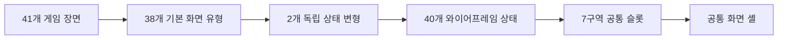

# Under the Horizon UI 와이어프레임 기준서

## 1. 문서 정보

| 항목 | 값 |
|---|---|
| 상태 | 승인 기준 |
| 작성일 | 2026-07-28 |
| 기준 게임명 | `Under the Horizon` |
| 기준 해상도 | 1920×1080 |
| 지원 해상도 | 1920×1200, 1280×720 |
| 기본 화면 유형 | 38종 |
| 별도 상태 변형 | 2종 |
| 와이어프레임 상태 | 40종 |
| 게임 장면 | 41개 |

이 문서는 사용자에게 보이는 화면의 정보 구조, 구역, 우선순위와 화면별 필수
요소를 정의한다.

세부 표현과 상호작용 결정은
`Under_the_Horizon_UI_Decision_Record_KR.md`를 따른다.

이 문서는 41개 장면마다 독립 UI를 새로 만드는 방식을 요구하지 않는다.
공통 셸과 40개 와이어프레임 상태를 조합해 모든 장면을 표현하는 것을 기준으로 한다.

## 2. 화면 수 계산

### 2.1 기본 화면과 상태 변형

| 묶음 | 기본 화면 | 상태 변형 | 와이어프레임 |
|---|---:|---:|---:|
| 진입·시스템 | 10 | 0 | 10 |
| 탐색·내러티브 | 11 | 1 | 12 |
| 추리·퍼즐 | 13 | 1 | 14 |
| 엔딩·재플레이 | 4 | 0 | 4 |
| 합계 | 38 | 2 | 40 |

`대화 선택 상태`는 일반 대화의 입력·레이아웃 변형이다.

`최종 지목`은 추리 시스템을 사용하지만 일반 퍼즐보다 정보 밀도와 진행 구조가
다르므로 독립 상태 변형으로 관리한다.

따라서 탐색·내러티브 항목 번호는 11번부터 22번까지 12개지만 기본 화면 유형은
11개로 계산한다.

## 3. 공통 7구역 마스터

### 3.1 기준 좌표

- 좌표와 크기는 전체 캔버스가 아니라 Safe Area를 기준으로 계산한다.
- 기준 캔버스는 1920×1080, 16:9다.
- 16:10에서는 배경을 늘이지 않고 세로 여유를 상·하단 구역에 분배한다.
- 1280×720에서는 동일한 정보 우선순위를 유지하고 장식 여백을 먼저 줄인다.
- 기준 안전 여백은 좌우 4%, 상하 3%다.
- 플랫폼 Safe Area가 더 크면 플랫폼 값을 우선한다.

### 3.2 구역 정의

| 구역 | 슬롯 ID | 기본 앵커 | 피벗 | 권장 크기 | 기본 역할 |
|---|---|---|---|---|---|
| 좌상단 | `screen.context.topLeft` | 좌상 | (0, 1) | 폭 20~28%, 높이 8~12% | 현재 문맥, 뒤로가기 |
| 상단 | `screen.objective.top` | 상단 중앙 | (0.5, 1) | 폭 44~60%, 높이 8~12% | 제목, 목표, 퍼즐 질문 |
| 우상단 | `screen.global.topRight` | 우상 | (1, 1) | 폭 20~28%, 높이 8~12% | 기록, 지도, 도움말, 일시정지, 닫기 |
| 좌하단 | `screen.tools.bottomLeft` | 좌하 | (0, 0) | 폭 22~32%, 높이 14~28% | 보조 도구, 필터, 이전 행동 |
| 하단 | `screen.reading.bottom` | 하단 중앙 | (0.5, 0) | 폭 52~76%, 높이 16~24% | 대사, 설명, 피드백, 시간축 |
| 우하단 | `screen.primary.bottomRight` | 우하 | (1, 0) | 폭 16~24%, 높이 10~18% | 현재 화면의 주요 행동 |
| 중앙 | `screen.content.center` | 전체 stretch | (0.5, 0.5) | 나머지 가용 영역 | 배경, 캐릭터, 지도, 기록, 퍼즐 |

### 3.3 구역별 규칙

#### 좌상단

- 뒤로가기와 취소가 필요하면 가장 먼저 배치한다.
- 장소, 인물, 기록 분류, 퍼즐 단계처럼 현재 문맥을 식별하는 정보를 둔다.
- 사용자가 현재 위치를 이해하는 데 필요하지 않은 내부 코드는 표시하지 않는다.

#### 상단

- 현재 화면에서 해결해야 할 질문 또는 목표 하나를 표시한다.
- 제목과 목표가 모두 필요하면 제목을 보조 크기, 목표를 주 크기로 표시한다.
- 상시 숫자 상태 게이지를 배치하지 않는다.

#### 우상단

- 플레이 화면의 기본 순서는 `조사 기록 / 지도 / 일시정지`다.
- 도움말과 닫기는 해당 화면에서 필요할 때만 추가한다.
- 같은 기능은 화면마다 위치와 아이콘 의미를 바꾸지 않는다.
- 사용할 수 없는 기능은 숨기거나 이유가 있는 비활성 상태로 표시한다.

#### 좌하단

- 필터, 도구, 질문 주제, 이전 행동 등 보조 선택을 배치한다.
- 취소가 좌상단에 들어갈 수 없으면 좌하단 첫 항목으로 둔다.
- 주요 확정 행동을 좌하단에 두지 않는다.

#### 하단

- 대사, 설명, 자연어 상태 피드백과 시간축을 위한 읽기 영역이다.
- 일반 대화에서는 화면 높이의 20~24%를 기준으로 한다.
- 긴 대사는 삭제하거나 말줄임하지 않고 페이지로 나눈다.
- 본문과 선택지는 같은 공간을 동시에 점유하지 않는다.

#### 우하단

- 현재 화면의 가장 중요한 행동 하나만 강조한다.
- 예: `확인`, `이동`, `조사`, `질문`, `검증`, `결론 확정`.
- 여러 후보를 고르는 과정에서는 후보 선택을 중앙 또는 좌하단에서 처리하고,
  우하단에는 최종 확정만 둔다.

#### 중앙

- 현재 화면의 핵심 조작 영역이다.
- UI가 장소 인물의 얼굴, 발, 주요 소품과 필수 단서를 가리지 않아야 한다.
- 배경이나 이미지의 종횡비를 유지한다.
- 확대·축소가 필요한 화면은 중앙 영역 내부에서만 변형한다.

## 4. 레이어와 표시 우선순위

| 레이어 | 용도 | 예시 |
|---:|---|---|
| 0 | 배경 | 장소, 컷신, 엔딩 배경 |
| 10 | 월드 대상 | 전신 인물, 소품, 출입구 |
| 20 | 기본 화면 셸 | 현재 목표, 전역 기능 |
| 30 | 상호작용 피드백 | 호버 윤곽, 포커스 이름 |
| 40 | 핵심 플레이 UI | 대화창, 퍼즐 도구, 기록 목록 |
| 50 | 오버레이 | 대화 기록, 지도, 조사 기록 |
| 60 | 모달 | 확인, 삭제, 덮어쓰기, 종료 |
| 70 | 알림·튜토리얼 | 새 기록, 목표 갱신, 스포트라이트 |
| 80 | 화면 전환 | 페이드, 로딩 차단 레이어 |

- 높은 레이어가 입력을 소유하면 아래 레이어는 입력을 받지 않는다.
- 시각적으로 투명해도 입력 차단 여부를 명시해야 한다.
- 닫기 또는 취소 입력은 가장 높은 레이어 하나에만 전달한다.
- 알림은 같은 레이어 안에서 큐로 순차 표시한다.

## 5. 입력과 포커스 계약

### 5.1 입력 소유권

- 기본 화면은 중앙 콘텐츠가 입력을 소유한다.
- 오버레이를 열면 오버레이가 입력을 소유하고 원래 화면은 상태만 유지한다.
- 모달을 열면 모달 외 입력을 차단한다.
- 모달을 닫으면 직전 선택 대상에 포커스를 복구한다.
- 지도와 조사 기록을 닫으면 진입 전 화면과 카메라 상태를 복구한다.

### 5.2 포커스 순서

키보드와 게임패드의 기본 포커스 순서는 다음과 같다.

1. 좌상단 뒤로가기 또는 문맥 선택
2. 중앙의 핵심 조작 대상
3. 좌하단 보조 도구
4. 우하단 주요 행동
5. 우상단 전역 기능

대화 선택 상태에서는 다음 순서를 사용한다.

1. 첫 번째 선택지
2. 나머지 선택지
3. 선택 확정
4. 기록 제시
5. 대화 기록·일시정지

### 5.3 접근성 탐색

- 접근성 탐색 모드는 상호작용 가능한 인물, 소품, 출입구를 순서대로 이동한다.
- 포커스된 대상에 윤곽과 자연어 이름을 함께 표시한다.
- 색상만으로 상호작용 가능 여부를 표현하지 않는다.
- 버튼과 대상에는 읽을 수 있는 접근성 이름을 제공한다.

## 6. 반응형 배치 계약

### 6.1 16:9

- 기준 와이어프레임 배치다.
- 중앙 배경과 캐릭터가 가장 넓은 영역을 사용한다.
- 대화창은 하단 20~24%를 사용한다.

### 6.2 16:10

- 배경을 세로로 늘이지 않는다.
- 늘어난 세로 공간은 상단 목표와 하단 읽기 영역의 여백에 우선 분배한다.
- 중앙의 인물과 소품 기준점은 16:9와 같은 월드 위치를 유지한다.

### 6.3 1280×720

- 장식, 구분선, 외곽 여백을 먼저 줄인다.
- 본문 크기, 클릭 영역, 주요 행동 버튼은 최소값 아래로 줄이지 않는다.
- 선택지 4~5개는 스크롤 또는 다단 배치를 사용한다.
- 주요 행동과 닫기 버튼은 화면 밖으로 이동하지 않는다.

### 6.4 UI 확대

- UI 100~160%에서 핵심 정보를 읽고 조작할 수 있어야 한다.
- 텍스트 확대 시 중앙 콘텐츠보다 읽기 영역을 우선 확보한다.
- 텍스트가 넘치면 글자를 생략하지 않고 페이지 또는 스크롤로 전환한다.

## 7. 공통 화면 셸

| 셸 | 적용 화면 | 유지 요소 |
|---|---|---|
| `SystemScreenShell` | 부팅, 타이틀, 저장, 로딩, 설정, 크레딧 | 시스템 배경, 제목, 메뉴 |
| `ExplorationScreenShell` | 탐색, 지도, 컷신 진입 | 장소 배경, 현재 목표, 전역 기능 |
| `DialogueScreenShell` | 대화, 선택, 기록, 심문 | 화자, 본문, 초상, 진행 입력 |
| `InvestigationScreenShell` | 확대 조사, 기록 보관함, 상세 비교 | 조사 목표, 도구, 기록 정보 |
| `PuzzleScreenShell` | 13개 추리·퍼즐 | 질문, 단계, 도구, 피드백, 검증 |
| `EndingScreenShell` | 엔딩, 후일담, 재플레이 | 결과 제목, 결과 본문, 다음 흐름 |
| `ModalOverlayShell` | 확인, 새 기록, 튜토리얼 | 배경 딤, 포커스 차단, 확인·취소 |

### 7.1 Unity Inspector 슬롯 매핑

모든 셸은 `UI Basic Scene/Canvas/Runtime UI Layout/Screen Shell Slots`의
공통 RectTransform 일곱 개를 기준으로 한다. 이 오브젝트에는
`RuntimeUiLayoutSlot`이 부착되어 Scene View에서 실행 전 위치·크기와 슬롯 ID를
확인할 수 있다.

| 와이어프레임 구역 | 슬롯 ID | 기본 정규화 영역 |
|---|---|---|
| 좌상단 문맥·취소 | `screen.context.topLeft` | `(0.02, 0.84)–(0.26, 0.98)` |
| 상단 제목·목표 | `screen.objective.top` | `(0.25, 0.84)–(0.75, 0.98)` |
| 우상단 전역 기능 | `screen.global.topRight` | `(0.74, 0.84)–(0.98, 0.98)` |
| 좌하단 보조 도구 | `screen.tools.bottomLeft` | `(0.02, 0.03)–(0.26, 0.20)` |
| 하단 읽기 영역 | `screen.reading.bottom` | `(0.20, 0.03)–(0.80, 0.30)` |
| 우하단 주요 행동 | `screen.primary.bottomRight` | `(0.74, 0.03)–(0.98, 0.20)` |
| 중앙 콘텐츠 | `screen.content.center` | `(0.02, 0.18)–(0.98, 0.86)` |

화면별 고정 UI는 공통 슬롯을 상속하고 필요한 영역만 화면 전용 슬롯으로
재정의한다. Map과 Evidence처럼 세부 배치가 필요한 화면은
`map.*`, `evidence.*` 슬롯을 사용한다. 컨트롤러는 해당 RectTransform의 좌표를
다시 계산하지 않고 데이터, 활성 상태와 입력 동작만 갱신한다.

런타임 개수나 장면 내용에 따라 달라지는 캐러셀 항목, NPC·소품 핫스폿,
원근·바닥선 캐릭터 배치와 애니메이션 좌표는 고정 슬롯 상속 대상에서 제외한다.

## 8. 진입·시스템 화면 10종

| ID | 화면 | 좌상단 | 상단 | 우상단 | 좌하단 | 하단 | 우하단 | 중앙 |
|---|---|---|---|---|---|---|---|---|
| WF-01 | 부팅·자동저장 안내 | 비움 | 작은 브랜드명 | 접근성 빠른 설정 | 자동저장 설명 | 저장 중 종료 금지 | 빌드 버전 | 로고와 선박 실루엣 |
| WF-02 | 타이틀 | 로고 | 비움 | 비움 | 시작·설정·크레딧·종료 | 저작권 | 버전 | MV Elysium과 밤바다 |
| WF-03 | 저장 슬롯 선택 | 뒤로가기 | 저장 슬롯 선택 | 슬롯 관리 | 슬롯 날짜·장소·시간 | 조작 안내 | 선택·시작 | 저장 슬롯 카드 3개 |
| WF-04 | 로딩 | 이동 장소·시간대 | 챕터·장면명 | 비움 | 게임 팁 분류 | 진행 상태 | 완료 후 계속 | 장소·사건 이미지 |
| WF-05 | Day·챕터 전환 | 직전 사건 요약 | Day·챕터명 | 건너뛰기 | 날짜·시간·항해 상황 | 핵심 문장 | 계속 | 전환 일러스트 |
| WF-06 | 일시정지 | 현재 장소·시간 | 일시정지 | 닫기 | 최근 자동저장 | 조작 안내 | 선택 확인 | 계속·저장·설정·타이틀 |
| WF-07 | 설정 | 설정 탭 | 설정 | 기본값 복원 | 옵션 설명 | 적용·취소 안내 | 적용 | 슬라이더·토글·키 설정 |
| WF-08 | 튜토리얼 오버레이 | 단계명 | 튜토리얼 제목 | 건너뛰기 | 입력 아이콘 | 행동 설명 | 다음·확인 | 스포트라이트와 화살표 |
| WF-09 | 확인 모달 | 비움 | 확인 제목 | 닫기 | 취소 | 결과·위험 설명 | 확인 | 중앙 모달 |
| WF-10 | 크레딧 | 뒤로가기 | 크레딧 | 속도·일시정지 | 라이선스 | 조작 안내 | 타이틀로 | 제작진·리소스 스크롤 |

### 시스템 화면 추가 규칙

- WF-01부터 WF-10에서는 플레이용 상단 HUD를 표시하지 않는다.
- WF-02에서 `새 게임`과 `이어하기`를 직접 표시하지 않는다.
- WF-03은 정확히 세 슬롯을 표시한다.
- 저장이 있는 슬롯은 이어서 시작하고 빈 슬롯은 프롤로그를 시작한다.
- WF-09의 배경 딤은 원래 화면을 식별할 수 있는 수준으로 유지한다.

## 9. 탐색·내러티브 화면 12상태

| ID | 화면 | 좌상단 | 상단 | 우상단 | 좌하단 | 하단 | 우하단 | 중앙 |
|---|---|---|---|---|---|---|---|---|
| WF-11 | 기본 탐색 | 장소·Day·시간대 | 현재 목표 | 기록·지도·일시정지 | 호버 대상·이전 장소 | 독백 발생 시에만 대사 | 상호작용 안내 | 배경·인물·소품·출입구 |
| WF-12 | 선내 지도·이동 | 층 선택 | 현재 위치·목적지 | 도움말·닫기 | 범례 | 이동 조건·장소 설명 | 이동 | 측면도·층별 평면도 |
| WF-13 | 일반 대화 | 화자·관계 상태 | 장소·대화 주제 | 로그·자동·일시정지 | 기록 제시 | 대사창 | 다음 | 화자 캐릭터 |
| WF-14 | 대화 선택 상태 | 화자 | 현재 질문·상황 | 로그·일시정지 | 기록 제시 | 직전 대사 유지 | 선택 확정 | 선택지 2~5개 |
| WF-15 | 대화 기록 | 대화로 돌아가기 | 대화 기록 | 검색·화자 필터 | 화자 목록 | 스크롤 안내 | 최신 대사 | 시간순 로그 |
| WF-16 | 확대 조사 | 조사 대상 | 조사 목표 | 기록·도움말·닫기 | 확대·회전·초기화 | 관찰 독백 | 자세히 보기·기록 | 확대 물품·현장 |
| WF-17 | 조사 기록 보관함 | 기록 분류 | 조사 기록 | 검색·정렬·닫기 | 세부 필터 | 선택 기록 설명 | 상세·비교·제시 | 기록 카드 목록 |
| WF-18 | 기록 상세·비교 | 보관함으로 | 기록명·비교 A/B | 닫기 | 발견 장소·관련 인물 | 에이드리언 메모 | 비교·제시·추리 사용 | 확대·좌우 비교 |
| WF-19 | 새 기록 획득 | 비움 | 새로운 기록 | 닫기 | 기록 분류 | 자연어 이름·설명 | 확인 | 기록 카드 애니메이션 |
| WF-20 | 일반 심문 | 인물·태도 | 심문 목표 | 기록·로그·일시정지 | 질문 주제·태도 | 질문·답변 | 질문·증거·계속 | 대상과 반응 연출 |
| WF-21 | 마커스 제한 심문 | 남은 질문 기회 | 제한 심문 | 기록·일시정지 | 질문 범주 | 예·아니오 반응 | 질문 확정 | 마커스 상태·질문 |
| WF-22 | 이벤트·컷신 | 필요 시 Day·시간 | 장소명 또는 비움 | 건너뛰기 | 비움 | 자막 | 종료 후 계속 | 전체 화면 연출 |

### 탐색 화면 표시 예산

한 장소의 권장 표시량은 다음과 같다.

- 전신 인물: 1~4명
- 이동 지점: 1~3개
- 환경 상호작용 대상: 4~8개
- 확대 조사 진입점: 1~3개

기본 상태에서는 클릭 포인트 아이콘과 이름표를 표시하지 않는다.

인물은 배경의 바닥선, 원근, 조명과 어울리는 전신으로 배치하고 전신 자체를
클릭 대상으로 사용한다.

### 대화 화면 규칙

- WF-13의 대사창은 하단 20~24%를 사용한다.
- 화자 초상과 본문은 서로 겹치지 않는다.
- 긴 대사는 페이지로 나누고 원문을 모두 표시한다.
- WF-14의 선택지는 대사창 위 중앙에 2~5개를 표시한다.
- 선택지가 열리면 다음 대사 버튼은 선택 확정과 혼동되지 않게 숨기거나 비활성화한다.
- 관계 상태는 숫자가 아닌 `경계`, `협조적`, `마음을 열고 있음` 같은 자연어로 표시한다.

## 10. 추리·퍼즐 화면 14상태

### 10.1 공통 Puzzle Shell

| 구역 | 퍼즐 공통 요소 |
|---|---|
| 좌상단 | 퍼즐 단계·도구 분류 |
| 상단 | 해결해야 하는 질문 |
| 우상단 | 힌트·초기화·나가기 |
| 좌하단 | 카드·조각·필터·도구 |
| 하단 | 인물 피드백·시간축·판정 설명 |
| 우하단 | 시험·검증·결론 확정 |
| 중앙 | 퍼즐별 핵심 조작 영역 |

### 10.2 퍼즐 상태 목록

| ID | 화면 | 좌상단 | 상단 질문 | 좌하단 도구 | 하단 피드백 | 우하단 행동 | 중앙 |
|---|---|---|---|---|---|---|---|
| WF-23 | 증거 보드·추리 | 기록 분류 | 활성 가설 | 미배치 기록 | 연결 논리 | 저장·검증 | 기록 노드·연결선 |
| WF-24 | 혈흔 재구성 | 복원 단계 | 혈흔 형성 방식 | 조각·실루엣·방향 | 헬레나 피드백 | 판정·결론 | 4×4 혈흔 보드 |
| WF-25 | CCTV·설비 로그 | 카메라 채널 | 22시 전후 움직임 | 채널 목록 | 시간 스크러버 | 비교 확정 | CCTV·로그 분할 |
| WF-26 | 이중 인증 추적 | 접근 기록 | 사용된 인증 | 인물 인증 카드 | 이상점 설명 | 연결·확정 | 기록 표·연결 영역 |
| WF-27 | 계단 추락 재구성 | 흔적 범례 | 마커스 추락 방식 | 발자국·자세·충돌 | 재생 제어 | 시뮬레이션·확정 | 평면도·측면도 |
| WF-28 | 클레어 진술 모순 | 진술 목록 | 실제 침입자 여부 | 증거 카드 | 모순 피드백 | 모순 지적·확정 | 진술·증거 연결 |
| WF-29 | 안정화 로그 분석 | 분석 필터 | 22:17 보정값 | 질량·방향 도구 | 측정값 | 이상 지점·확정 | 파도·안정화 그래프 |
| WF-30 | 화물 레일 분기 | 경로 범례 | 평형수 구역–호라이즌 룸 연결 | 스위치 S1~S4 | 시험 카트 상태 | 시험·경로 확정 | 선박 레일 구조도 |
| WF-31 | 루미놀 현장 조사 | 조명 모드 | 세척 흔적 복원 | 샘플 슬롯 | 에이드리언·헬레나 반응 | 분사·채취·확정 | 확대 현장 |
| WF-32 | 사인 분류 | 법의학 카드 | Daniel 직접 사인 | 분류 기준 | 카드 피드백 | 사인 선택·확정 | 사망·위장·교란 3열 |
| WF-33 | 사건 타임라인 | 미배치 사건 | 21:22~22:45 재구성 | 조건 미확정 카드 | 시간·충돌 경고 | 순서 검증 | 3개 시간 레인 |
| WF-34 | 보호면 압수·DNA | 분석 단계 | 현재 논리 질문 | 근거·마커 | 법적·법의학 피드백 | 검사·일치 확정 | 논리 슬롯·DNA 비교 |
| WF-35 | 오르페우스호 음성 복원 | 음성 조각 | 15년 전 음성 복원 | 속도·노이즈 도구 | 파형·재생 | 구간 저장·결론 | 8개 파형 조각 |
| WF-36 | 최종 지목 | 현재 1/6~6/6 단계 | 현재 지목 질문 | 후보 분류 탭 | 논증 요약 | 이 답으로 확정 | 후보 카드·증거 슬롯 |

### 10.3 최종 지목 6단계

WF-36은 다음 순서를 고정한다.

1. 범인
2. 실제 살해 장소
3. 직접 사인
4. 시신 운반법
5. 유인 동기
6. 오르페우스호 설계자

- 각 단계에는 답 후보와 필수 증거 부착 슬롯을 제공한다.
- 현재 단계와 완료 단계는 숫자 진행 단계로 표시할 수 있지만 게임 상태 수치를
  표시하지 않는다.
- 최종 제출 전 전체 논증을 자연어 문장으로 검토할 수 있어야 한다.
- 중단 시 결과가 사라질 수 있음을 우상단에서 경고한다.

## 11. 엔딩·재플레이 화면 4종

| ID | 화면 | 좌상단 | 상단 | 우상단 | 좌하단 | 하단 | 우하단 | 중앙 |
|---|---|---|---|---|---|---|---|---|
| WF-37 | 엔딩 결과 | 엔딩 배지 | 로고·엔딩명 | 비움 | 해결·공개·인물 결과 | 결과 요약 | 후일담·마지막 선택·타이틀 | 엔딩 일러스트 |
| WF-38 | 인물 후일담 | 인물 탭 | 사건 이후 | 닫기 | 전체 결과 이동 | 후일담 본문 | 다음 인물 | 선택 인물 일러스트 |
| WF-39 | 챕터 선택·재플레이 | 뒤로가기 | 챕터 선택 | 정렬·필터 | 잠김·해금 범례 | 사건 요약 | 이 챕터부터 시작 | Day별 챕터 카드 |
| WF-40 | 배드 엔드·재시도 | 실패 원인 | 배드 엔딩명 | 비움 | 마지막 저장 위치 | 악화된 결과 | 체크포인트·타이틀 | 결과 아트 |

## 12. 오버레이와 모달 계약

### 12.1 배경 딤

- 원래 장소와 인물을 식별할 수 있도록 배경을 약 55~65% 어둡게 한다.
- 텍스트 대비가 부족하면 모달 패널 불투명도를 높이고 배경을 완전히 지우지 않는다.

### 12.2 닫기

- `ESC` 또는 취소 입력은 가장 위에 열린 패널 하나만 닫는다.
- 닫힌 뒤에는 패널을 열기 직전의 포커스와 카메라를 복구한다.
- 확인 버튼은 우하단, 취소는 좌상단 또는 좌하단에 둔다.

### 12.3 알림 큐

다음 알림은 동시에 겹쳐 표시하지 않는다.

1. 새로운 기록 획득
2. 상태 변화
3. 목표 갱신

먼저 발생한 알림부터 표시하고, 중요도가 높은 스토리 차단 알림만 현재 알림을
중단할 수 있다.

## 13. 상태 정보 표현

### 13.1 표시하지 않는 정보

- Trust 숫자와 분수
- Public Anxiety 숫자와 백분율
- Evidence Integrity 숫자와 백분율
- 상시 상태 게이지
- 단서 코드
- 총 단서 수
- 수집률

### 13.2 표시하는 정보

- 현재 행동 판단에 필요한 자연어 관계 상태
- 선내 분위기 변화
- 현장 보존 상태 변화
- 기록의 자연어 이름과 발견 맥락
- 현재 목표와 완료 피드백

상태 메시지는 게임 화면의 상시 HUD가 아니라 짧은 문맥 메시지나 선택 결과
피드백으로 표시한다.

## 14. 와이어프레임 작성 표준

각 와이어프레임에는 다음 주석을 반드시 포함한다.

- 와이어프레임 ID와 화면명
- 기본 화면 또는 상태 변형 여부
- 사용하는 공통 셸
- 7구역 중 활성 구역
- Safe Area 경계
- 기준 해상도와 화면비
- 입력 소유 레이어
- 최초 포커스 대상
- 취소 시 이동 대상
- 우하단 주요 행동
- 스크롤 또는 페이지 처리 영역
- 빈 상태, 잠김 상태, 오류 상태
- UI 160% 확대 시 변화

와이어프레임은 색상과 최종 아트를 확정하는 문서가 아니다.
정보 구조와 상호작용 우선순위를 검증할 수 있도록 회색조와 역할 라벨을 우선한다.

## 15. 완료 기준

- WF-01부터 WF-40까지 ID가 중복 없이 존재한다.
- 38개 기본 화면과 2개 상태 변형의 계산이 문서 전체에서 일치한다.
- 모든 화면이 공통 7구역 중 필요한 슬롯을 선언한다.
- 모든 화면의 우하단 주요 행동이 하나로 식별된다.
- 모든 오버레이와 모달에 취소·닫기 동작이 있다.
- 시스템 화면에 플레이용 숫자 상태 HUD가 보이지 않는다.
- 탐색 화면에서 인물과 소품 자체를 직접 선택할 수 있다.
- 클릭 포인트는 호버·포커스·접근성 모드에서만 나타난다.
- 단서 코드, 총량, 수집률을 사용자에게 표시하지 않는다.
- 긴 대사는 생략하지 않고 페이지 또는 스크롤로 처리한다.
- 16:9, 16:10, 1280×720에서 주요 행동이 Safe Area 안에 있다.
- UI 100~160%에서 텍스트와 버튼이 서로 겹치지 않는다.
- 키보드·마우스·게임패드로 필수 진행이 가능하다.
- 색상 없이 성공, 실패, 잠김과 선택 상태를 구분할 수 있다.

## 16. 이번 문서의 범위 밖 작업

다음 작업은 이 문서에서 수행하지 않는다.

- 41개 장면과 WF-01~WF-40의 상태 전이 매핑
- 개별 와이어프레임 이미지 제작
- Unity `RuntimeUiLayoutSlot` 키와 실제 프리팹 연결
- 현재 숫자형 HUD의 코드·씬 제거
- 상태 자연어의 최종 임계값 밸런싱
- 아트 에셋과 애니메이션 최종 제작

후속 문서는 이 기준서의 ID와 구역 정의를 참조해야 한다.
